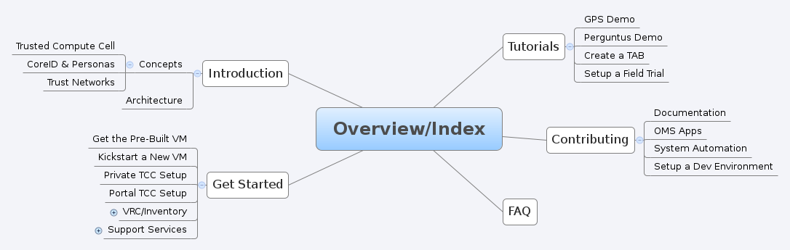

:title: Contributing to Documentation
:description: How to Contributed Documentation to OMS
:keywords: contributing, oms, documentation, help, guideline

.. _contribute_docs:

Contributing Documentation
==========================

This guide will provide the reader with the information needed to get started
with contributing to the project's documentation.

The end result will be an understanding of the following:

* where to see the latest source code for the documentation
* how to get setup to hack on the docs
* guiding principals and conventions

.. note::

   Please see the :github-readme:`oms-docs README <oms-docs>` for additional
   details on contributing to the oms-docs src/repository.

Where to find source code
-------------------------

The OMS project documentation is source code, formatted as `ReStructured Text`_,
built by `Sphinx`_, version controlled with `git`_, and :github-repo:`hosted on
GitHub <oms-docs>`.

.. _ReStructured Text: http://docutils.sourceforge.net/rst.html
.. _Sphinx: http://sphinx-doc.org/index.html
.. _git: http://git-scm.com/

How to get started
------------------

Getting started is easy, Though we need to reset our expectations. It is not
possible to open a word document, or create a new wiki article and start making
updates.

The project documentation is interacted with and maintained as code because it
is code. We are not writing novels or fiction or prose; we are writing technical
descriptions, design details, how-tos etc - we use the tools and maintain
practices that are well-suited to the needs of this environment:

* track all changes, from updates to style, images, diagrams, references, and
  content;
* distributed development, but must stay in sync with OMS codebase;
* leverage modular design and  automation, reuse code and practices, keep it
  simple;
* keep it easy to hack on and a joy to write and maintain our docs.

At present, the simplest way to get started is to use an OMS Host, as this will
be setup with all the tools needed to hack on oms-docs. You can get an OMS Host
as an :ref:`Importable VM Image <importable_vms>`, or you can create an OMS Host
using the :ref:`OMS Kickstart Provisioning Tools <kickstart_oms>`.

Once you have an OMS host, you can use this shortcut to install the sphinx
dependencies. we use ``test=True`` first so we can evaluate the results from salt
before it makes any changes to the system:

.. code:: bash

   oms% salt-call --local state.sls oms.doc_dev test=True
   oms% salt-call --local state.sls oms.doc_dev

We are now ready to build the docs. Sphinx and its dependencies have been
installed into a python virtualenv, so we activate that environment before
running ``make``. Building the docs will create a bunch of output, with artifacts
created in the ``_build/html/`` directory.

.. code:: bash

   oms% source /var/oms/python/oms-docs/bin/activate
   (oms-docs) oms% cd /var/oms/src/oms-docs/
   (oms-docs) oms% make oms-docs
   ...
   (oms-docs) oms% ls -alh _build/html/
   total 128K
   drwxr-xr-x 17 root root 4.0K Dec  8 23:35 .
   drwxr-xr-x  4 root root 4.0K Dec  8 23:34 ..
   drwxr-xr-x  2 root root 4.0K Dec  8 23:34 api
   drwxr-xr-x  3 root root 4.0K Dec  8 23:34 builder
   -rw-r--r--  1 root root  230 Dec  8 23:35 .buildinfo
   drwxr-xr-x  4 root root 4.0K Dec  8 23:34 concepts
   drwxr-xr-x  3 root root 4.0K Dec  8 23:34 contributing
   drwxr-xr-x  2 root root 4.0K Dec  8 23:34 faq
   drwxr-xr-x  2 root root 4.0K Dec  8 23:34 genindex
   drwxr-xr-x  9 root root 4.0K Dec  8 23:34 get_started
   drwxr-xr-x  2 root root 4.0K Dec  8 23:34 _images
   -rw-r--r--  1 root root  15K Dec  8 23:34 index.html
   drwxr-xr-x  6 root root 4.0K Dec  8 23:34 introduction
   -rw-r--r--  1 root root 1.1K Dec  8 23:35 objects.inv
   drwxr-xr-x  8 root root 4.0K Dec  8 23:34 oidc
   drwxr-xr-x  2 root root 4.0K Dec  8 23:34 search
   -rw-r--r--  1 root root  33K Dec  8 23:35 searchindex.js
   drwxr-xr-x  8 root root 4.0K Dec  8 23:34 _sources
   drwxr-xr-x  5 root root 4.0K Dec  8 23:35 _static
   drwxr-xr-x  2 root root 4.0K Dec  8 23:34 toctree
   drwxr-xr-x  6 root root 4.0K Dec  8 23:34 tutorials

Improving the Workflow
----------------------

As noted above, running ``make oms-docs``, leaves us with the documentation
project rendered as HTML. All assets are HTML/CSS/JS and similar static content
that can easily be hosted with any HTTP server.

You should not need to setup nginx just to hack on the docs though, so we have
``make server`` available to us as a dev server, for development purposes.

While ``make oms-docs`` is a rather wonderfully simple way to build the docs, we
need to run this on an update to any ``.rst`` document source file before we
could review the change as rendered HTML, even with a simple dev server. To
address this, the current implementation supporting ``make server`` is based on
node.js and grunt.js to simplify the workflow.

The result? Grunt.js monitors all ``.rst`` source files in the documentation
project, running tasks when an update is made. In other words, grunt ensures the
developer does not need to rebuild the project with each change, nor reload the
dev server. This solution also includes use of the *live-reload* capability of
grunt.js and node.js, leaving us with a complete solution - after each update to
a ``.rst`` source file, the developer only needs to pause a moment while grunt.js
rebuilds the docs and reloads the developer's browser.

Setup node and grunt.js
~~~~~~~~~~~~~~~~~~~~~~~

Ensure you have the grunt cli node package:

.. code:: bash

   (oms-docs) oms% npm -g install grunt-cli
   npm http GET https://registry.npmjs.org/grunt-cli
   npm http 200 https://registry.npmjs.org/grunt-cli
   ...
   ... <snip>
   ...
   /usr/bin/grunt -> /usr/lib/node_modules/grunt-cli/bin/grunt
   grunt-cli@0.1.13 /usr/lib/node_modules/grunt-cli
   resolve@0.3.1
   nopt@1.0.10 (abbrev@1.0.4)
   findup-sync@0.1.2 (lodash@1.0.1, glob@3.1.21)

Install the node.js dependencies for the documentation project:

.. code:: bash

   (oms-docs) oms% npm install
   ...
   ... <snip>
   ...
   grunt-contrib-watch@0.5.3 node_modules/grunt-contrib-watch
   gaze@0.4.3 (globule@0.1.0)
   tiny-lr@0.0.4 (debug@0.7.4, faye-websocket@0.4.4, qs@0.5.6, noptify@0.0.3)
   grunt-contrib-connect@0.7.1 node_modules/grunt-contrib-connect
   connect-livereload@0.3.2
   open@0.0.4
   async@0.2.10
   portscanner@0.2.2 (async@0.1.15)
   connect@2.13.0 (uid2@0.0.3, methods@0.1.0, cookie-signature@1.0.1, pause@0.0.1, fresh@0.2.0, qs@0.6.6, debug@0.7.4, bytes@0.2.1, buffer-crc32@0.2.1, raw-body@1.1.2, batch@0.5.0, cookie@0.1.0, compressible@1.0.0, negotiator@0.3.0, send@0.1.4, multiparty@2.2.0)

Open up some firewall ports:

.. code:: bash

   (oms-docs) oms% ufw allow 9000

   # the second port is for live-reload
   (oms-docs) oms% ufw allow 9001

In a separate tmux pane/window or console/shell, run the grunt/node dev server:

.. code:: bash

   # all node.js and grunt components are in place, we can now run the dev server
   (oms-docs) oms% make clean oms-docs server
   rm -rf _build/*
   Running "make_oms_docs" task
   make[1]: Entering directory `/var/oms/src/repos/oms-docs'
   sphinx-build -b dirhtml -d _build/doctrees   sources _build/html
   Running Sphinx v1.1.3
   loading pickled environment... not yet created
   building [dirhtml]: targets for 40 source files that are out of date
   updating environment: 40 added, 0 changed, 0 removed
   reading sources... [  2%] api/index
   reading sources... [  5%] contributing/documentation
   ...
   ... <snip>
   ...
   copying static files... done
   dumping search index... done
   dumping object inventory... done
   build succeeded, 16 warnings.

   Build finished. The documentation pages are now in _build/html.
   make[1]: Leaving directory `/var/oms/src/repos/oms-docs'

   Done, without errors.
   Completed in 4.546s at Thu Mar 06 2014 22:37:03 GMT+0000 (UTC) - Waiting...

Point your browser at http://$ip:9000 to see HTML docs served up by the
minimal HTTP server (replace *$ip* with the IP of your OMS Host).

At this point, you may want to review the :github-readme:`oms-docs README
<oms-docs>` for details about restructured text, sphinx, and style conventions
found in oms-docs.

The next section details how to leverage the build tools included in oms-docs
to simplify the work in building, reviewing, and updating sphinx doc projects
in an arbitrarily long list of source code repositories.

Can we make it better?
----------------------

Let's first review the documentation embedded in our Makefile:

.. frustratingly, this code is not yet working, it'll include an extraneous
.. line we don't want, and in the final rendered output you will see:
.. make[2]: Entering directory `/home/oms/repos/oms-docs'
..
.. .. runblock:: console
..
..    $ make help
.. so instead, we generate this manually:

.. code::

   $ make help
   Please use 'make <target>', where <target> is one of the following:

     clean      to run an rm -rf on everything in the build directory
     oms-docs   to build the local project, oms-docs, rendered as HTML.
     all        to build the all doc projects, rendered as HTML.
     serve      to serve the docs to your browser via `http://0.0.0.0:9000`,
                using node.js and grunt to watch for changes and auto-reload.
     serve-all  to serve the HTML build, using grunt to watch all doc projects,
                (not just oms-docs) for changes.
     dirhtml    to make HTML files named index.html in directories
     singlehtml to make a single large HTML file
     json       to make JSON files
     latex      to make LaTeX files, you can set PAPER=a4 or PAPER=letter
     latexpdf   to make LaTeX files and run them through pdflatex
     text       to make text files
     man        to make manual pages
     changes    to make an overview of all changed/added/deprecated items
     linkcheck  to check all external links for integrity
     doctest    to run all doctests embedded in the documentation (if enabled)

   Note that, for each of the following repositories:

     oms-admin
     oms-core
     oms-deploy
     oms-experimental
     oms-kickstart
     oms-oidc
     oms-salt-core
     oms-salt-tcf
     oms-ui
     oms-vrc
     python-oidc

   ..each of the following targets are available:

     html       to make standalone HTML files
     singlehtml to make a single large HTML file
     json       to make JSON files
     text       to make text files
     man        to make manual pages
     changes    to make an overview of all changed/added/deprecated items
     linkcheck  to check all external links for integrity
     doctest    to run all doctests embedded in the documentation (if enabled)

   These are available in the form: make <project>-<target>

   For example: make oms-core-html
                make oms-deploy-doctest
   and so on...

   In addition, the target 'all_docs-html' will run the HTML build for
   the sphinx documentation projects listed when creating this Makefile.

   (the list of projects to be built is as noted above)

   The variables in this Makefile are set as follows:

     PYTHON:        python
     BUILDDIR:      _build
     SPHINXOPTS:
     SPHINXBUILD:   sphinx-build
     ALLSPHINXOPTS: -d _build/doctrees

   In general, you will want to either:

     a) build/host oms-docs, eg: 'make oms-docs serve'
     b) build/host all doc projects, eg: 'make all serve-all'
     c) you want to clean first, eg: 'make clean all serve-all'
     d) build something specific, eg: 'make oms-deploy-linkcheck'

Of particular interest are the details about ``make all`` and ``make serve-all``,
these are the make targets associated with building and serving all doc projects
configured within the Makefile.

.. _update_doc_builder:

Add a repository
~~~~~~~~~~~~~~~~

How do you update the multi-project doc build to include new repositories? At
the moment, it requires a few updates:

#. Open ``oms-docs/conf/config-gen.py`` for editing.
#. Locate the list of repositories, ``project_list``, and add the name of the
   project to this list - this project is expected to exist as a directory
   one-level up from oms-docs (in the same directory as oms-docs).
#. Jump into the ``conf`` directory and run ``python config-gen.py`` with no
   arguments. This will create a new Makefile, Gruntfile.js, and zGruntfile.js.
#. Overwrite the old Makefile: ``cp Makefile ../``
#. Create a new directory, in your project: ``mkdir docs``
#. Create a python config for the sphinx doc project:
   ``cp ../oms-docs/sources/conf.py ./docs/``.
#. Edit the config to be specific to your project.
#. Add the ``toctree.rst`` and ``index.rst`` documents, using existing sources
   in OMS as examples. The index page is the front/first page for the projects's
   documentation, while the toc tree is the Table of Contents.
#. TEST! use ``make clean all serve-all`` to test everything together, though
   you can use ``make project-html``, where *project* is the name of the project
   specified in the update to the ``project_list`` variable.

Maybe you need to dig deeper
~~~~~~~~~~~~~~~~~~~~~~~~~~~~

Let's look at what tasks the default Gruntfile provides, these are specific to
oms-docs:

.. .. runblock:: console
..
..    $ cd ../conf && grunt --help

.. code::

   Grunt: The JavaScript Task Runner (v0.4.5)

   Usage
    grunt [options] [task [task ...]]

   Options
        --help, -h  Display this help text.
            --base  Specify an alternate base path. By default, all file paths are
                    relative to the Gruntfile. (grunt.file.setBase) *
        --no-color  Disable colored output.
       --gruntfile  Specify an alternate Gruntfile. By default, grunt looks in the
                    current or parent directories for the nearest Gruntfile.js or
                    Gruntfile.coffee file.
       --debug, -d  Enable debugging mode for tasks that support it.
           --stack  Print a stack trace when exiting with a warning or fatal
                    error.
       --force, -f  A way to force your way past warnings. Want a suggestion?
                    Don't use this option, fix your code.
           --tasks  Additional directory paths to scan for task and "extra" files.
                    (grunt.loadTasks) *
             --npm  Npm-installed grunt plugins to scan for task and "extra"
                    files. (grunt.loadNpmTasks) *
        --no-write  Disable writing files (dry run).
     --verbose, -v  Verbose mode. A lot more information output.
     --version, -V  Print the grunt version. Combine with --verbose for more info.
      --completion  Output shell auto-completion rules. See the grunt-cli
                    documentation for more information.

   Options marked with * have methods exposed via the grunt API and should instead
   be specified inside the Gruntfile wherever possible.

   Available tasks:
     make_clean      run make clean on build directory/artifacts
     make_oms_docs   run sphinx build on oms-docs only
     serve_oms_docs  Alias for "connect", "watch" tasks.
     default         Alias for "make_oms_docs", "serve_oms_docs" tasks.
     watch           Run predefined tasks whenever watched files change.
     connect         Start a connect web server. *

There is an additional Gruntfile available for serving the build artifacts and
then watching all doc projects, here are the tasks provided:

.. .. runblock:: console
..
..    $ cd ../conf && grunt --help --gruntfile conf/zGruntfile.js

.. code::

   Available tasks:
     make_clean                  run make clean on build directory/artifacts
     make_oms-admin_html         run sphinx make for oms-admin
     make_oms-core_html          run sphinx make for oms-core
     make_oms-deploy_html        run sphinx make for oms-deploy
     make_oms-experimental_html  run sphinx make for oms-experimental
     make_oms-kickstart_html     run sphinx make for oms-kickstart
     make_oms-oidc_html          run sphinx make for oms-oidc
     make_oms-salt-core_html     run sphinx make for oms-salt-core
     make_oms-salt-tcf_html      run sphinx make for oms-salt-tcf
     make_oms-ui_html            run sphinx make for oms-ui
     make_oms-vrc_html           run sphinx make for oms-vrc
     make_python-oidc_html       run sphinx make for python-oidc
     make_oms_docs               run sphinx build on oms-docs only
     make_all_docs               run sphinx build for all docs
     serve_all_docs              Alias for "connect", "watch" tasks.
     default                     Alias for "make_oms_docs", "serve_oms_docs" tasks.
     build_all                   Alias for "make_all_docs", "serve_all_docs" tasks.

If using these Gruntfiles directly, you will likely want the 'serve_all_docs',
'default', and 'build_all' tasks noted above.

The majority of these Grunt tasks are actually intended for use internally,
within the rest of the Gruntfile - eg, when using Grunt to watch the source
directories for changes, Grunt has tasks for cleaning and rebuilding the
build artifacts.

.. note::

   oms-docs currently uses two Gruntfile.js specs for Grunt, one that focuses
   on serving/watching the oms-docs sphinx project, and one capable of monitoring
   all projects. Both can be found within the *oms-docs/conf/* directory.

Intended Layout of OMS Documentation
------------------------------------

For the documentation on this site, our intended layout is described by the
following mindmap:

.. note::

   This mindmap can be edited with `XMind`_, the source is located in
   ``oms-docs/sources/xmind/layout_of_oms-docs.xmind``. It needs to be updated,
   but is still mostly correct (it's missing OIDC and upcoming changes to TCC)

.. _XMind: http://www.xmind.net/

.. note::

   This is partly correct, but needs a few updates.
