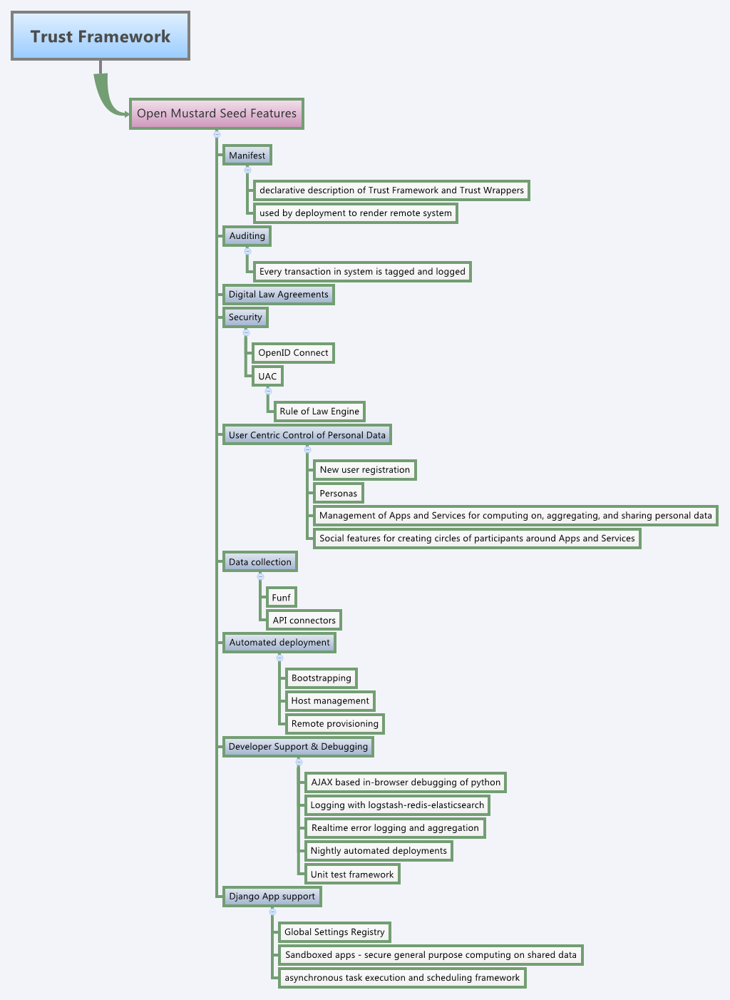

:title: Open Mustard Seed Documentation
:description: An overview of the OMS Documentation
:keywords: OMS, Open Mustard Seed, TCF, concepts, explanation

.. _overview:

Open Mustard Seed Trusted Compute Framework
===========================================

**A Framework for developing and deploying secure cloud applications to collect, compute on, and share personal data**

Introducing the Open Mustard Seed Framework

* Many features you would expect out of an operating system for the cloud
* Developer support enables rapid creation of cloud based private social mobile applications
* Secured access using OpenID Connect
* Portable access control manifest reduces the pain of user access control management
* Modular composition of Resource Requests (claims and REST interfaces)
* Modular structure of service APIs and access control defined using legal constraints
* Automated deployment of Service Components (from hardware to complete cloud-based mobile application deployment)
* Personal Data Service providing cloud storage and secure computation
 

The Open Mustard Seed project is an open-source framework for developing and deploying web apps in a secure, user-centric personal cloud. The framework provides a stack of core technologies that work together to provide a high level of security and ease of use when sharing and collecting personal and environmental data, controlling web-enabled devices, and engaging with others to aggregate information and view the results of applied computation via protected services.

The scope of this effort is largely driven by the needs of the Trust Framework architecture for personal data ecosystems being developed at ID3.

Overall, the project aims to contribute a layer of software and methodology for the development, deployment, and management of user-centric, data-intensive, and distributed cloud applications and services.

Releases
--------

Soon to be available as an alpha-release (Summer 2013), OMS will provide a new infrastructure to let people build their own highly distributed social ecosystems for reliably managing all sorts of shared resources, including their personal data. The software is a synthesis of a variety of existing software systems - for digital identity, security, computable legal contracts and data-management - designed to serve as a new platform for social and economic exchange. Just as the original HTML code gave rise to the World Wide Web and new types of bottom-up social communication and collaboration, OMS can be conceived as a new "social stack" of protocols.

Reinventing Big Data
--------------------

OMS solves a number of interrelated problems about Big Data. Users have not had an easy or reliable means to express their preferences for how their personal data may be accessed and used, especially when one context (a bank) differs so much from another (a healthcare provider) and still others (family and friends). A user may not know with whom they are really transacting, nor can they readily verify that their privacy preferences are actually respected and enforced. Users are often wary of exposing or sharing their data with third parties whose trustworthiness is not known. In this context, it is not surprising that protecting one's personal information is seen as antithetical to commercial and governmental uses of it.

The Open Mustard Seed project seeks to overcome these problems through a technical architecture called the "Trustworthy Compute Framework" (TCF). The TCF extends the core functionality of "Personal Data Stores" (PDS) - digital repositories in the cloud that let users strictly control their personal information - by enabling online users to interact flexibly in secure, trustworthy ways. The system architecture uses nested tiers of "trusted compute cells" starting at the "private" level and moving up to portal and group levels. The idea is to enable trusted social relationships and collaboration that can scale. Each Trusted Compute Cell (TCC) - the basic unit of individual control over data - enables users to curate their digital personas; manage the data that they collect, produce and distribute; manage privacy settings for the various social scenes and commercial vendors they interact with; and manage the installation and availability of group-specific apps and services developed to be deployed within various TCF architectures.

Data Empowerment
----------------

The terms of interaction between an individual's private TCC and any other TCC is mediated with OpenID Connect-authenticated API connections. These application programming interfaces have their terms and means of interaction and information-disclosure policies specified through Trusted Application Bundles (TAB). TABs contain digital legal contracts that outline the opt-in terms of agreement for online interactions provided by the deployment of the APIs contained within the TAB's Manifests. These agreements are subsequently enforced, on behalf of the persona- within the TCF to which the TAB instance was deployed. Furthermore, TABs specify what data may be collected, accessed, stored, how it may be used, etc.; what access control mechanisms and policies will govern data; and the "constitutional rules" by which groups may form, manage themselves, and evolve.

.. Note:: We are presently going through some terminology changes. Please use Trusted Application Bundle (TAB) and Trust Wrapper interchangeably.

Leveraging the Open-Source Community
------------------------------------

The framework is made possible by integrating and building on top of numerous projects including (we strongly believe in the DRY principles):

* `Python`_
* `Django`_, `Tastypie`_
* `Bootstrap`_, `Backbone.js`_, `Underscore.js`_
* `Funf`_
* `PyCLIPS`_
* `OpenID Connect`_
* `Jinja2`_, `ConfigObj`_
* `Salt Stack`_, `Zeromq`_, `Nginx`_, `uWSGI`_, `Celery`_, `Fabric`_, `OpenStack`_
* `Logstash`_, `Redis`_, `Elasticsearch`_
* `Werkzeug`_, `Sentry`_

.. _Python: http://www.python.org/
.. _Django: https://www.djangoproject.com/
.. _Tastypie: http://tastypieapi.org/
.. _Bootstrap: http://twitter.github.com/bootstrap/
.. _Backbone.js: http://backbonejs.org/
.. _Underscore.js: http://underscorejs.org/
.. _Funf: http://funf.org/
.. _PyCLIPS: http://pyclips.sourceforge.net/web/
.. _OpenID Connect: http://github.com/mitreid-connect/OpenID-Connect-Java-Spring-Server/
.. _Jinja2: http://jinja.pocoo.org/
.. _ConfigObj: http://www.voidspace.org.uk/python/configobj.html
.. _Salt Stack: http://saltstack.org/
.. _Zeromq: http://www.zeromq.org/
.. _Nginx: http://wiki.nginx.org/Main
.. _uWSGI: http://
.. _Celery: http://celeryproject.org/
.. _Fabric: http://docs.fabfile.org/en/latest/
.. _OpenStack: http://www.openstack.org/
.. _Logstash: http://logstash.net/
.. _Redis: http://redis.io/
.. _Elasticsearch: http://www.elasticsearch.org/
.. _Werkzeug: http://werkzeug.pocoo.org/
.. _Sentry: http://github.com/getsentry/sentry/

OMS Features
------------

Here is a mindmap of the features of the OMS TCF:

Learn More
----------

Want to know more? :ref:`Start with the OMS Introduction <introduction>`

