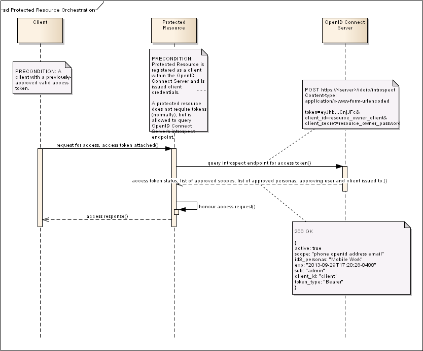

:title: Integrating A Protected Resource
:description: Integrating a Protected Resource For The Purposes of Validating a Token 
:keywords: oms, oidc, setup

.. _integrating_protected_resource:

Integrating A Protected Resource
================================

A resource with restricted access needs a way to identify clients allowed to
access it. In the OAuth world, every protected resource has a trusted OAuth
server, which authorizes clients to talk to it. Two interactions are involved:
The OAuth server talks to the client to grant certain access to it (covered in a
great detail in the :ref:`Token Retrieval <token_retrieval>` page), and the
protected resource talks to the OAuth server to validate this access.

Currently token validation is performed using the /tokenscope endpoint: an
unauthenticated endpoint, which serves to answer questions like "Does token X is
allowed for scope Y". The sanctioned mechanism to do so is by using the
introspect endpoint and the interaction is a bit different:

Several things of note, which differ from the way the tokenscope endpoint is
being used:

* A protected resource is a client to the OIDC server as well.

Every resource asking to validate a token must be registered as a client to the
OIDC server. This client must have the "Allow introspection" checkbox checked on
the client's Administration screen.

* A protected resource must possess all scopes approved on token in order to
  inquire about it or else it must be the client that token was issued to.

The protected resource may not be exposed to scopes it is not approved for. This
has the implication that a client needs one token for every protected resource
it intends to access individually, as protected resources will not in general
have each other's scopes and will not be able to validate a cross-resource
token. A client can, of course, inquire about its own tokens freely, provided it
is allowed to talk to the introspection endpoint. A dynamically-registered
client is never allowed to talk to the introspection endpoint.

* A protected resource must authenticate to the OIDC server using its client
  credentials in order to use the introspection endpoint.

The /tokenscope endpoint is unauthenticated, open to the world. The
introspection endpoint requires the protected resource's client credentials as
well as the token being queried.

* The introspection endpoint returns the full token metadata.

The /tokenscope endpoint is used to query for individual scopes, while the
introspect endpoint returns everything the token entitles its bearer.

* The introspection endpoint has been extended for persona support.

The server maintains the identity of the personas approved for a token, and will
return the list of approved personas.

How To Define A Protected Resource In OIDC
------------------------------------------

A protected resource is a client to the OIDC server as well, but it has to be
specially provisioned for it. There is no clear-cut distinction saying "this is
a protected resource and that is a regular client", there is nothing stopping a
properly configured OIDC client from acting as both. There are, however,
features specific to a protected resource that a regular OIDC client will not
usually have:

* Access to the introspection endpoint. A regular client uses the tokens issued
  to it and gets told everything it needs to know about them at the time they
  are issued to it, so it normally has no use for the introspection endpoint.
* A large number of scopes on its client record, but few (if any) mechanisms to
  get a token with any of them. A protected resource can only validate tokens
  with a strict subset of its own scopes, so a protected resource will have
  every scope it can expect to encounter. It will not, in general, have a need
  to get a token, so it won't have the grant types allowing it to get any on its
  own.
* Redelegation grant type. This is the only grant type specific to a protected
  resource and allows a protected resource to derive a token in its own name
  from that of an upstream client for use with downstream protected resources. A
  regular client won't need to do that as it can get a token directly or with a
  user any time it wishes.
* Is never a dynamically-registered client. OIDC is created with the assumption
  that it will handle a relatively small and fixed number of protected
  resources, so dynamic registration of protected resources is currently not
  supported.

Every protected resource has to be defined against the OIDC server either with a
specially-written SQL script, or through the admin UI, in order to integrate with it.

Introspection Endpoint Output for Access Token
----------------------------------------------

Whenever a token is set to never expire, the "exp" field will not be returned. 
Whenever a client is approved without a user, the sub field is set to the
client's client ID and no id3_personas field will be returned. Please note that
a dynamically registered client within the ID3 OIDC implementation is attached
to a set of governing user personas (see list of extensions) and will have both
a user and personas returned.

An empty (but present) id3_personas field implies no personas were approved, the
token was approved for individual scopes only.

REQUEST:

.. code::

   POST https://localhost/idoic/introspect
   Accept: application/json

   token=eyJhbGciOiJSUzI1NiJ9.eyJleHAiOjEzODE3MDM2...ZkJGkzM&client_id=protected_resource&client_secret=protected_resource_secret

RESPONSE:

.. code::

   200 OK
   Content-Type: application/json;charset=ISO-8859-1 

   {
   "active":true,
   "scope":"initial-client-registration-token openid phone email address profile",
   "id3_personas":"Home Mobile",
   "exp":"2013-10-13T18:34:14-0400",
   "sub":"admin",
   "client_id":"id3-oic-demo-client",
   "token_type":"Bearer"
   }

Introspection Endpoint Output for ID Token
------------------------------------------

Note that since a protected resource cannot inquire about tokens with scopes it
itself does not possess, I had to add the "id-token" scope to my protected resource.

REQUEST:

.. code::
   
   POST https://localhost/idoic/introspect
   Accept: application/json

   token=eyJhbGciOiJSUzI1NiJ9.eyJhdXRoX3RpbWUiOjEzODE3M...RANbE_M&client_id=protected_resource&client_secret=protected_resource_secret

RESPONSE:

.. code::

   200 OK
   Content-Type: application/json;charset=ISO-8859-1 

   {
   "active":true,
   "scope":"id-token",
   "id3_personas":"Superclient Work",
   "exp":"2013-10-13T18:10:53-0400",
   "sub":"admin",
   "client_id":"gps-demo-client",
   "token_type":"Bearer"
   }

Introspection Endpoint Output for Refresh Token
-----------------------------------------------

A refresh token is issued to a client and should never be used for accessing
anything. Inquiring after a refresh token is only meaningful when the client
itself is interested in the contents of its token.

Whenever a refresh token is set to not expire, the "exp" field will not be
returned (as in the example below). With refresh tokens significantly more
long-lived than access tokens, this will be fairly common.

The id3_personas field will always be returned for refresh tokens as a user is
always involved in the process of getting one. Whenever the id3_personas is
empty, no personas were approved and the token was approved for individual
scopes only.

REQUEST:

.. code::
   
   POST https://localhost/idoic/introspect
   Accept: application/json

   token=eyJhbGciOiJub25lIn0.eyJqdGkiOiJjZWE0ZDVkOC1jYjFlLTQ2MjctODhlNC1mMjM4YjMxNzEwNzQifQ.&client_id=id3-oic-demo-client&client_secret=c2b3e080-1923-4b16-9a85-786104d29cf8

RESPONSE:

.. code::

   200 OK
   Content-Type: application/json;charset=ISO-8859-1 

   {
   "active":true,
   "scope":"offline_access openid profile",
   "id3_personas":"Home",
   "sub":"admin",
   "client_id":"id3-oic-demo-client"
   }

Introspection Endpoint Output for Registration Token
----------------------------------------------------

A registration token is issued to a dynamically-registered client so that it can
maintain its own client record and should only be used with the OIDC server
itself. A registration token is no good for accessing protected resources and
should never be sent to any protected resources.

Inquiring after a registration token is meaningless as a dynamically-registered
clients are not allowed to talk to the introspection endpoint and protected
resources do not have the internal-use-only scope required to query them.

A registration token is implemented with both its subject and client_id set to
the assigned client_id for the client, never has any personas on it, and has a
lone "registration-token" scope. A registration token does not expire.
