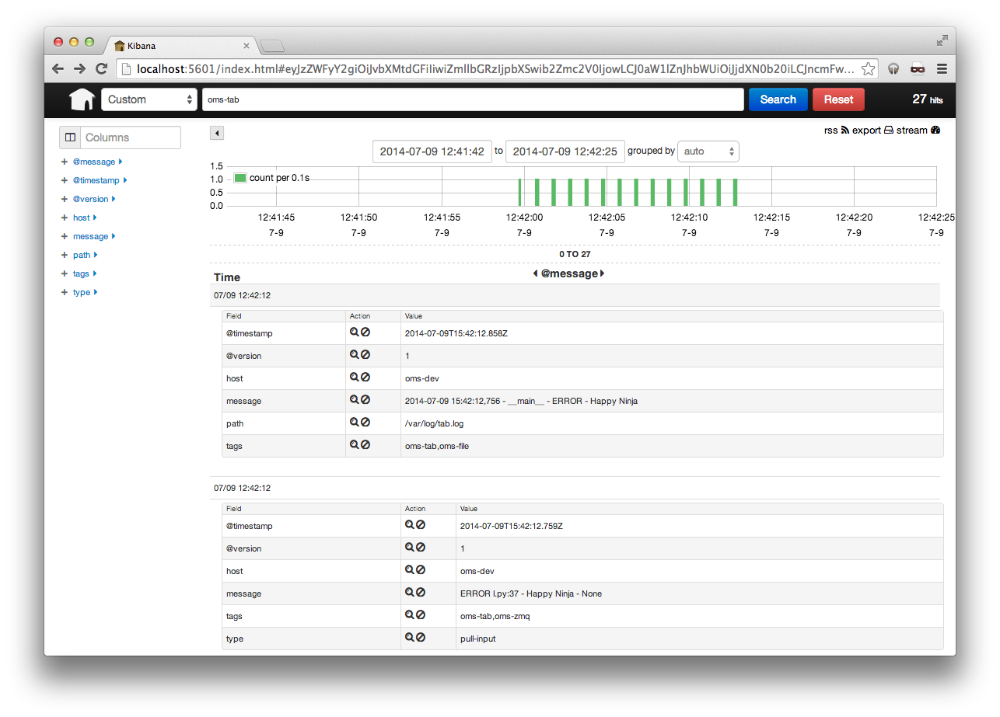

******************************
TAB Logging with the OMS Layer
******************************

This tutorial will show you how to use the logging capabilities provided by the
OMS Layer.

.. _logging_tutorial_overview:

========
Overview
========

OMS provides logging facilities for the different TABS. These logging
facilities are not mandatory and may be ignored, however, using them will
provide services like log aggregation and filtering.

The Logging facilities in the OMS Layer is comprised of several different
components.

::

                 +-----+                             +----------+
                 | TAB |                             |  Kibana  |
                 +--+--+                             +----+-----+
                    |                                     |
                    |                                     |
                    |                                     |
                    |                                     |
            +-------v---------+        +------------+     |
            | Logging Element <--------+  Logstash  |     |
            +-----------------+        +-----+------+     |
                                             |            |
                                             |            |
                                             |            |
                                       +-----v------------v-----+
                                       |      Elasticsearch     |
                                       +------------------------+

A TAB, will use a Logging Element to log any messages it desires. Such a
Logging element may be a File, Message queue etc. Each log message in the
Logging Element is read by Logstash. Once a message is read, it is sent to
Elasticsearch for indexing. Finally, a user, can view these logs using the
Kibana application on their browser, who fetches the indexed logs form
Elasticsearch.

===================
Logging from Python
===================

To use the OMS Layer's Logging facilities nothing special has to be done in
your Python modules at all. Log messages can be stored anywhere you desire, you
could use a file, Redis, a database, etc. The important thing is that they
should be stored in a place where Logstash is allowed to access. More
information on this topic can be found in the
`Logstash documentation <http://logstash.net/docs/1.4.2/>`_ under the
``inputs`` section.

While it is not mandatory to use Python's built-in `logging` module, it is
expected to do so for various reasons, mainly maintainability.

=========================
Using Kibana to view Logs
=========================

`Kibana <http://www.elasticsearch.org/overview/kibana/>`_ is an application,
written in Javascript, that runs in the browser and allows its user to view
logs that were previously read by Logstash and stored in Elasticsearch for
indexing.

Note that there are some security restrictions concerning the use of Kibana and
Elasticsearch. If you want to access the Kibana service, you may need to build
an SSH tunnel to your rTCC.

===================================
Changing the Logstash Configuration
===================================

The Logstash configuration file resides in ``/etc/logstash.conf``. However,
this file is generated based on a template, meaning that if it's edited
manually, it will be overwritten when running a deploy on the machine.

On order to modify the file, the Logstash manifest needs to be modified this
ensuring that the proper configuration file is generated and that that no
configuration values will be lost.

---------------------
The Logstash Manifest
---------------------

The Logstash Manifest, ``/etc/salt/states/manifests/logstash.yml`` contains in
a ``YAML`` dictionary the values with which the Logstash config file will be
generated with.

The entry relevant to log sources, or inputs, is the
``parameters.logstash.config.inputs`` key. To this key, you should add (or
edit) an entry relevant to your needs. **This should all be done in your TAB's
manifest**. For example, we could add a file, ``/var/log/watch_this.log`` as a
new input like so:

.. code-block:: yaml

  parameters:
    logstash:
      config:
        inputs:
          new_file:
            type: file
            params:
              path: "['/var/log/watch_this.log']"
              tags: "['oms-tab']"

Note a couple of things things:

* The ``path`` key, expects a list of files, though we only specified one.
* We added a ``tag`` using the ``tags`` key. Note that here, a list is also
  expected.

`Here <http://logstash.net/docs/1.4.2/inputs/file>`_ is some more information
regarding using files as inputs. You can also ind more information about inputs
in the `Logstash documentation <http://logstash.net/docs/1.4.2/>`_.

If you're not unsure on how the configuration file is generated, you can take a
look at the template it is generated from. You can find it at
``/etc/salt/states/logstash/etc/logstash.conf``.

---------------------------------
Generating the configuration file
---------------------------------

So far we only edited the manifest that generates the template, but we have not
generated the template itself. To do so, you need to call Salt and tell it
that you wish to install Logstash. In order to do so, you can use
``salt-call`` like so:

.. code-block:: bash

  salt-call --local state.sls logstash

If you wish to see debug information you may specify the ``--log-level=debug``
option.

============================================
Putting it all together in A Simple Example®
============================================

In this example we will:

1. Create a Python module that will log messages in two different places.
2. Update the manifest accordingly.
3. View the logs in Kibana.

Before we start, make sure your rTCC meets the following requirements:

* The ``python-json-logger`` package (install using pip).
* The ``ffi-rzmq`` gem must be installed.
* ``libzmq1`` and ``libzmq-dev`` using your package manager.

This example is very simple, but manages to demonstrate how powerful using
Elasticsearch + Logstash + kibana can be.
Also note that for simplicity, in this example we will not be building a TAB,
it will be just a Python module and we will edit Logstash's manifest directly.

---------------------
Simple example module
---------------------

Here is a very simple Logging module. It will generate random messages and log
them to a file, as well a in ZMQ.

The code is pretty straightforward:

.. code-block:: python

  import time
  import logging
  import random

  import jsonlogger
  from zmq.log.handlers import PUBHandler

  # Set up our first Log. Messages will be written as JSON
  formatter = jsonlogger.JsonFormatter
  # Set up the first handler (ZMQ)
  handler = PUBHandler('tcp://127.0.0.1:2121')
  handler.root_topic = 'oms-tab'
  handler.setFormatter(formatter)

  # Set up the second handler (file - /var/log/tab.log)
  fhandler = logging.FileHandler('/var/log/tab.log')
  formatter = logging.Formatter('%(asctime)s - %(name)s - %(levelname)s - %(message)s')
  fhandler.setFormatter(formatter)

  # Setup the logger
  logger = logging.getLogger(__name__)
  logger.setLevel(logging.INFO)
  logger.addHandler(handler)
  logger.addHandler(fhandler)

  adj = ['Happy', 'Big', 'Small', 'Green', 'Smooth']
  noun = ['Face', 'Hand', 'Toaster', 'Ninja', 'Puppy']

  print 'Starting to generate messages...'
  while True:
      # Create a new message
      msg = "{0} {1}".format(adj[int(random.random() * len(adj))], noun[int(random.random() * len(noun))])

      # Send the message
      print 'Sending message: {0}'.format(msg)
      logger.error(msg)

      # Wait a little while..
      time.sleep(1)

Here, two loggers are set up. One of them will send messages to a file, while
the other will send messages to a ZMQ Queue. After being set up, random
messages are generated every one second and sent to the loggers.

If you go back to the diagram in the :ref:`logging_tutorial_overview` section,
this module corresponds to your TAB, and both the File we are logging to and
the Queue are the Logging Elements we are using.

----------------------
Logstash configuration
----------------------

We have our TAB and it's logging messages, however, we need to configure
Logstash so that it picks up these messages and sends them for indexing. In
order to do so, we will edit our TAB's manifest and edit it accordingly. In
this case, we want to:

1. Read from the file.
2. Read from the queue.
3. Add tags to those messages so we can find them more easily later on form
   Kibana.

In order to see what we need to add to the configuration, we need to read the
Logstash documentation, especially the
`inputs/file <http://logstash.net/docs/1.4.2/inputs/file>`_ and
`inputs/zeromq <http://logstash.net/docs/1.4.2/inputs/zeromq>`_ pages.

Our configuration should look like this:

.. code-block:: yaml

 inputs:
   tabfile:
     type: file
     params:
       path: "['/var/log/tab.log']"
       tags: "['oms-tab', 'oms-file']"

   tabzmq:
     type: zeromq
     params:
       address: "'tcp://127.0.0.1:2121'"
       mode: "'client'"
       tags: "['oms-tab', 'oms-zmq']"
       topic: "['oms-tab']"
       topology: "'pushpull'"
       type: "'pull-input'"

Open ``/etc/salt/states/manifests/logstash.yml`` and edit the ``inputs``
section accordingly.

As you can see, we added an input for files (with only one file) and an input
for the ZMQ Queue. Also note that we gave tags to the messages. You should not
re-generate your Logstash config:

.. code-block:: bash

  salt-call --local state.sls logstash

### Running the example

The Logstash service should already be running in your rTCC. All that is needed
is running the example module. If all goes well, generated messages will be
indexed by Logstash and be made available.

We can query our newly generated logs by using Kibana. In order to access
Kibana you will first need to create an SSH tunnel to your rTCC. Suppose that
your rTCC is `oms-dev`, you can create an SSH like so:

.. code-block:: bash

  ssh -N root@oms-dev -L 5601:localhost:5601

Once your SSH tunnel is up, point your browser to ``http://localhost:5601/``.

You should be able to see the generated messages. If you go into the details of
each message, you can also see that some are being read form the file and some
are being read form ZMQ.
